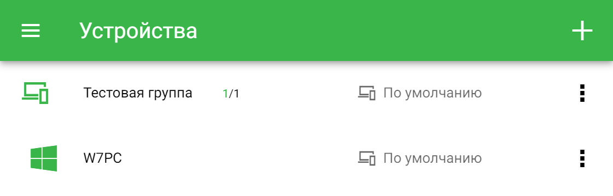
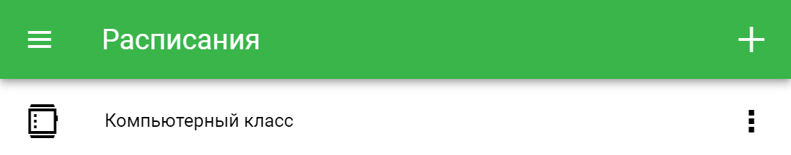

<h1>Руководство по личному кабинету</h1>

[TOC]

## Доступ в личный кабинет

Доступ к личному кабинету пользователя системы фильтрации контента Этикум может быть осуществлён с любого устройства, на котором установлен один из современных браузеров, по адресу: https://app.eticum.com.

Для доступа в кабинет необходимо пройти процесс регистрации, описанный в разделе «[Регистрация](#Регистрация)».

Для удобства использования личного кабинета вы можете добавить приложение Этикум на рабочий стол. На рис. 1 показан способ установки личного кабинета, открытого в браузере Google Chrome на компьютере под управлением ОС Windows.

*Рис. 1. Добавление ярлыка «Этикум» на рабочий стол*

При доступе в личный кабинет с мобильных устройств существует возможность добавления приложения Этикум на главный экран. На рис. 2 показано предложение установки приложения в браузере Google Chrome для Android.

*Рис. 2. Предложение добавить «Этикум» на главный экран*

## Регистрация

Для начала использования личного кабинета необходимо зарегистрироваться.

> Если у вас уже есть логин и пароль для входа в систему, можете перейти к разделу «[Вход в личный кабинет](#Вход в личный кабинет)».

Для открытия бокового меню необходимо нажать кнопку  в левом верхнем углу страницы. Ссылка на страницу регистрации находится в боковом меню (рис. 3).

*Рис. 3. Ссылки «Вход» и «Регистрация» в боковом меню*

На странице «Регистрация» расположена форма регистрации (рис. 4). В системе предусмотрены два вида аккаунтов: аккаунт домашнего пользователя и аккаунт организации. Отличия по стоимости подписки и ограничения по количеству устройств для каждого из видов аккаунтов описаны на странице «[Подписка](https://www.eticum.com/subscription/)» на нашем сайте.

*Рис. 4. Форма регистрации для организаций*

Форма регистрации организации включает поля Название организации, Имя, Должность (представителя организации), Электронная почта, Пароль (дважды), переключатель для автоматического создания профилей фильтрации для образовательных организаций, а также флажок согласия с политикой конфиденциальности и ссылку на текст политики конфиденциальности. Все поля формы обязательны для заполнения. Минимальная длина пароля — 8 символов. Этот пароль понадобится для входа в фильтрующее приложение.

После нажатия кнопки  в правом верхнем углу выводится либо сообщение, содержащее ошибку, если она возникла, либо уведомление об отправленном письме для подтверждения адреса электронной почты, если при отправке формы не возникло проблем.

Сразу после отправки формы на адрес электронной почты, указанный при регистрации, будет отправлено письмо, содержащее ссылку для подтверждения email. Для завершения процесса регистрации необходимо перейти по ссылке из письма на страницу подтверждения (рис. 5).

*Рис. 5. Страница подтверждения email*

После нажатия кнопки  в правом верхнем углу выводится сообщение об успешном или неуспешном подтверждении адреса электронной почты. Если подтверждение email прошло успешно, учётные данные можно использовать для входа в личный кабинет.

## Вход в личный кабинет

Для входа используется страница входа (рис. 6), открывающаяся при переходе в личный кабинет или доступная по ссылке «Вход» в боковом меню (рис. 3).

*Рис. 6. Страница входа в личный кабинет*

Страница входа содержит форму с полями ввода адреса электронной почты и пароля. Кроме того, форма содержит ссылку на страницу Сброс пароля, которая описана в разделе «[Восстановление входа](#Восстановление входа)».

После заполнения формы для входа необходимо нажать кнопку  в правом верхнем углу страницы.

После успешного входа в личный кабинет происходит перенаправление на страницу «[Устройства](#Устройства)».

## Обзор возможностей

Личный кабинет предназначен для **централизованного управления** процессом фильтрации на всех устройствах, где установлено фильтрующее приложение и выполнен вход с вашими учётными данными. Навигация по разделам личного кабинета осуществляется через меню, открывающееся нажатием кнопки  в левом верхнем углу страницы.

На странице «[Устройства](#Устройства)» содержится список подключенных устройств, организованных в группы. Группы устройств можно создавать без ограничений. Управлять фильтрацией можно как на уровне группы, так и на уровне каждого устройства.

На странице «[Профили](#Профили)» представлен список профилей фильтрации, каждый из которых определяет, как именно будет осуществляться фильтрация, если этот профиль будет применён к устройству. Создавать новые профили фильтрации и изменять существующие можно без ограничений.

Страница «[Расписания](#Расписания)» содержит список расписаний, каждое из которых определяет в какое время будет действовать тот или иной профиль фильтрации. Расписания можно создавать без ограничений. Для каждой группы устройств или отдельного устройства можно выбрать своё расписание смены профиля фильтрации.

Страница «[Списки](#Списки)» состоит из редактируемых списков, позволяющих разрешать или запрещать доступ к определённым ресурсам вне зависимости от действующего профиля фильтрации, а также определять слова и словосочетания, по которым может осуществляться фильтрация.

На странице «[Аккаунт](#Аккаунт)» представлена информация о пользователе личного кабинета.

Подробно каждая из этих страниц описана далее в этом руководстве.

## Устройства

На странице «**Устройства**» содержится список всех устройств с установленным фильтрующим приложением, на которых выполнен вход с использованием вашей учётной записи Этикум. Для удобства управления список может быть разделён на группы. 

**Группы устройств** создаются пользователем самостоятельно и могут объединять устройства по физическому расположению (например, компьютеры в классе), по логической роли (компьютеры администрации) или принадлежности (устройства, находящиеся в пользовании одного человека). Пользователь может создавать неограниченное количество групп, каждое устройство может находиться только в одной группе. 

Настройки фильтрации можно задавать как для каждого отдельного устройства, так и для всей группы в целом. При этом настройки, сделанные для устройства, приоритетнее групповых. 

Сразу после регистрации в личном кабинете на странице «Устройства» показывается сообщение об отсутствии устройств для отображения (рис. 7). Для того, чтобы устройства начали появляться на странице «**Устройства**», необходимо установить на устройство фильтрующее приложение Этикум и выполнить вход с использованием учётной записи Этикум. 

*Рис. 7. Страница «Устройства» без добавленных групп и устройств*

Дистрибутивы фильтрующих приложений доступны на странице «[Загрузки](#Загрузки)».

> Процесс получения учётной записи описан в разделе «[Регистрация](#Регистрация)».

**Устройства**, на которых установлено фильтрующее приложение Этикум и выполнен вход, появятся на странице «Устройства», свёрнутые в группу «Вне групп». Для отображения устройств в группе необходимо щёлкнуть левой кнопкой мыши по имени группы (рис. 8).

*Рис. 8. Устройство в группе «Вне групп»*

Каждое устройство представлено иконкой, иллюстрирующей платформу (в примере на рис. 8 — Windows), именем устройства (в примере — «W7PC») и профилем фильтрации (в примере — «По умолчанию»). 

> Зелёный цвет иконки устройства означает, что устройство в настоящий момент активно. Интервал обновления данных об активности устройств — 2 минуты.

Устройства, находящиеся в группе «Вне групп», для управления процессом фильтрации необходимо переносить в созданные пользователем группы. Группы можно создавать двумя способами. Первый способ подразумевает создание группы со страницы «**Устройства**» и описан ниже. Второй способ позволяет создать группу в процессе изменения устройства и описан далее в этом разделе.

Для создания новой группы устройств необходимо нажать кнопку  в правом верхнем углу страницы «**Устройства**» (рис. 8), после чего откроется форма добавления новой группы (рис. 9).

*Рис. 9. Форма добавления новой группы*

Для группы необходимо ввести имя. Имя группы отображается в списке групп на странице «**Устройства**». Для группы можно выбрать один из существующих профилей фильтрации, либо создать новый. Также для группы можно установить существующее расписание автоматической смены профилей фильтрации, либо создать новое. Подробнее о профилях и расписаниях рассказано в разделах «[Профили](#Профили)» и «[Расписания](#Расписания)». После заполнения полей в форме добавления группы необходимо нажать кнопку  в правом верхнем углу страницы. Созданная группа отобразится в списке на странице «**Устройства**». 

Вы всегда можете отменить изменения, сделанные в форме, нажав кнопку  в левом верхнем углу страницы. 

На рис. 10 показана созданная группа с именем «Тестовая группа». 

*Рис. 10. Созданная группа в списке на странице «Устройства»*

> Если в созданной пользователем группе в настоящий момент есть активные устройства, то количество активных устройств в группе выводится рядом с именем группы зелёным цветом. Рядом через слеш выводится общее количество устройств в группе. Если в настоящий момент активных устройств в группе нет, то выводится только общее количество устройств в группе. 
>  Если все устройства в группе активны, значок группы выводится зелёным цветом.

Для просмотра дополнительной информации о группе устройств необходимо нажать кнопку  в соответствующей группе строке списка групп и в появившемся списке выбрать «Посмотреть» (рис. 11). 

*Рис. 11. Список действий для группы устройств*

На открывшейся странице (рис. 12) содержится имя группы, профиль фильтрации, установленный на группе, действующий для группы профиль фильтрации и расписание автоматической смены профилей. Нажав кнопку  в правом верхнем углу, можно перейти в форму редактирования группы. Нажатие кнопки  в левом верхнем углу осуществляет возврат на предыдущую страницу.

*Рис. 12. Дополнительная информация о группе устройств*

Для изменения параметров группы необходимо нажать кнопку  в соответствующей группе строке списка групп на странице «Устройства» и в появившемся списке выбрать «Изменить» (рис. 11). Откроется форма изменения группы, аналогичная форме добавления новой группы (рис. 9).

Для удаления группы устройств необходимо нажать кнопку  и в появившемся списке выбрать «Удалить» (рис. 11). Будет предложено подтвердить или отменить удаление группы.

> Устройства, находившиеся в удалённой группе, переместятся в группу «Вне групп», а все настройки для них сбросятся.

Чтобы посмотреть данные об устройстве необходимо нажать кнопку  в соответствующей устройству строке списка устройств. В появившемся списке действий (рис. 13) необходимо выбрать «Посмотреть». 

*Рис. 13. Список действий для устройства*

Откроется страница, содержащая дополнительную информацию об устройстве: идентификатор устройства, версию фильтрующего приложения, версию операционной системы, дату установки, дату последней активности, группу, в которой находится устройство, профиль фильтрации, установленный на устройстве, действующий профиль фильтрации и установленное расписание (рис. 14). 

На предыдущую страницу можно вернуться, нажав кнопку  в левом верхнем углу. Перейти к изменению настроек устройства можно, нажав кнопку  в правом верхнем углу. 

*Рис. 14. Дополнительная информация об устройстве*

Открыть форму изменения устройства можно также со страницы «Устройства». Для этого необходимо нажать кнопку  в соответствующей устройству строке списка устройств. В появившемся списке действий необходимо выбрать «Изменить» (рис. 13).

Откроется форма изменения устройства (рис. 15).

*Рис. 15. Форма изменения устройства*

Для изменения имени устройства необходимо указать его в поле Имя устройства. Первоначально поле Имя устройства содержит значение, введённое при вводе учётных данных в фильтрующем приложении Этикум. Имя устройства можно изменить, при этом изменённое имя также будет отображаться на основном экране приложения Этикум Статус (Windows).

Чтобы добавить устройство в одну из существующих групп, необходимо выбрать имя этой группы в выпадающем списке Группа, либо создать новую группу, выбрав «Добавить группу» из выпадающего списка. 

Если был выбран пункт «Добавить группу», откроется форма создания группы (рис. 9). После создания группы её имя будет выбрано в поле Группа в форме изменения устройства.

Так же, как и для группы, из выпадающих списков выбираются существующие, либо создаются новые [профиль фильтрации](#Профили) и [расписание](#Расписания). Для устройства можно использовать профиль фильтрации, установленный на группе, выбрав значение «Из группы» в выпадающем списке Профиль.

После заполнения формы необходимо нажать кнопку  в правом верхнем углу страницы. Изменения отобразятся на странице «**Устройства**». На рис. 16 показано устройство W7PC, перенесённое в группу «Тестовая группа».

*Рис. 16. Устройство, перенесённое в созданную группу*

Для удаления устройства необходимо нажать кнопку  в соответствующей устройству строке списка и в появившемся списке действий выбрать «Удалить» (рис. 13). Будет предложено подтвердить или отменить удаление.

> После удаления устройства из личного кабинета фильтрующее приложение, установленное на этом устройстве, будет выводить форму для ввода логина и пароля. Фильтрация на таком устройстве осуществляться не будет.

Для изменения порядка групп и устройств в списке устройств необходимо перетащить группу или устройство за специальную область, обозначенную значком  слева от значка группы или устройства (рис. 11).

## Профили

На странице «**Профили**» представлен список профилей фильтрации, созданных пользователем, каждый из которых определяет, как именно будет осуществляться фильтрация, если этот профиль будет применён к устройству. Сразу после регистрации пользователю доступен либо набор профилей, созданный автоматически (если при регистрации не был отключен переключатель «Создать профили фильтрации», показанный на рис. 4), либо один профиль фильтрации, использующийся по умолчанию. На рис. 17 показан набор профилей фильтрации, созданный автоматически при регистрации организации.

*Рис. 17 Список профилей*

> Единственный профиль, доступный сразу после регистрации с отключенной опцией «Создать профили фильтрации», можно редактировать. Так как этот профиль не имеет имени (в списке отображается «По умолчанию»), при редактировании следует указать имя профиля.

Для создания нового профиля фильтрации необходимо нажать кнопку  в правом верхнем углу страницы (рис. 17), после чего откроется форма добавления нового профиля (рис. 18).

*Рис. 18. Форма добавления нового профиля*

Переключатель «Использовать этот профиль по умолчанию» позволяет назначить создаваемый или редактируемый профиль для использования в качестве профиля по умолчанию. В списке профилей такой профиль отмечен значком .

Профиль, для которого установлен переключатель «Использовать по умолчанию», устанавливается для устройства, если на группе, в которую оно входит, или на самом устройстве установлено расписание, и в этом расписании отсутствует явное указание профиля для данного промежутка времени. Подробнее об особенностях такого поведения рассказано в разделе «[Расписания](#Расписания)». 

> Профиль, отмеченный как профиль по умолчанию, устанавливается на все устройства, находящиеся в группе «Вне групп».

Для создаваемого профиля необходимо ввести имя. Это имя будет отображаться в списке профилей на странице «**Профили**», а также в выпадающих списках выбора профиля в формах добавления/изменения группы устройств (рис. 9), редактирования устройства (рис. 15) и форме добавления/изменения правила расписания (см. раздел «[Расписания](#Расписания)»).

Для профиля необходимо указать режим фильтрации. Для выбора доступно три режима:

- Белый список — доступ предоставляется только к ресурсам, удовлетворяющим возрастным ограничениям и входящим в список разрешённых категорий. Доступ к неклассифицированным ресурсам блокируется.
- Чёрный список — доступ предоставляется ко всем ресурсам, кроме тех, которые не удовлетворяют возрастным ограничениям или входят в список запрещённых категорий. Доступ к неклассифицированным ресурсам предоставляется.
- Без фильтрации — доступ предоставляется ко всем ресурсам.

Независимо от выбранного режима фильтрации доступ всегда предоставляется к ресурсам, указанным в списке «Разрешить», и всегда блокируется к ресурсам, содержащимся в списке «Запретить». Подробно об этом рассказано в разделе «[Списки](#Списки)».

Для режимов фильтрации «Белый список» и «Чёрный список» доступно включение дополнительных опций (рис. 19):

- Фильтрация по словам — содержимое страниц фильтруется по содержанию слов и словосочетаний, внесённых в список слов для блокировки (см. раздел «[Списки](#Списки)»).
- Сбор статистики посещаемых сайтов и страниц — позволяет формировать журнал посещения интернет-ресурсов.
- Сбор статистики активности — позволяет анализировать время использования устройства.

*Рис. 19 Дополнительные поля в форме добавления/изменения профиля*

Если выбран режим фильтрации «Белый список» или «Чёрный список», то в профиле необходимо установить возрастное ограничение в поле «Возраст (полных лет)» (рис. 19). Если возрастное ограничение интернет-ресурса не больше возраста, указанного в профиле, то доступ предоставляется. Если больше — доступ блокируется. Причина блокировки указывается на странице блокировки.

Для профиля в режимах фильтрации «Белый список» или «Чёрный список» можно выбрать одну или несколько тематических категорий, по принадлежности к которым будет осуществляться фильтрация доступа к интернет-ресурсам (рис. 19). Если в профиле установлен режим фильтрации «Белый список», то доступ будет разрешён только к ресурсам, которые относятся к выбранным в профиле категориям. Если установлен режим «Чёрный список», то доступ будет запрещён к ресурсам, которые относятся к выбранным категориям. 

> Для режима «Без фильтрации» в выборе дополнительных опций, возрастного ограничения и категорий нет необходимости.

После нажатия кнопки  в правом верхнем углу страницы созданный профиль отобразится в списке профилей. На рис. 20 показан новый профиль с именем «Для Андрея».

*Рис. 20. Созданный профиль в списке профилей*

Чтобы посмотреть данные о профиле фильтрации необходимо нажать кнопку  в соответствующей профилю строке списка профилей. В появившемся списке действий (рис. 21) необходимо выбрать «Посмотреть». 

*Рис. 21. Список действий для профиля*

Откроется страница, содержащая сводную информацию о выбранном профиле (рис. 22): режим фильтрации, дополнительные опции, возраст и список категорий (при наличии). 

На предыдущую страницу можно вернуться, нажав кнопку  в левом верхнем углу. Перейти к изменению настроек профиля можно, нажав кнопку   в правом верхнем углу. 

Любой существующий профиль фильтрации можно установить на группу устройств, тогда все устройства, входящие в данную группу, будут наследовать этот профиль. Если на группе установлено расписание смены профиля, то для группы будет использоваться профиль, заданный расписанием. Если профиль группы определяется расписанием, то рядом с именем профиля в списке групп устройств будет отображаться значок . Если для группы используется профиль по умолчанию, то рядом с именем профиля в списке групп будет отображаться значок .

*Рис. 22. Сводная информация о профиле*

Для любого устройства можно выбрать профиль индивидуально, переопределив тем самым настройки, заданные для группы. Если на устройстве установлено расписание, то для этого устройства будет использоваться профиль, заданный расписанием. Если профиль устройства задан на группе, в которую входит устройство, то рядом с именем профиля в списке устройств будет отображаться значок . Если профиль устройства определяется расписанием, то рядом с именем профиля в списке устройств будет отображаться значок . Если для устройства используется профиль по умолчанию, то рядом с именем профиля в списке устройств будет отображаться значок .

Для изменения профиля необходимо нажать кнопку  и в появившемся списке выбрать «Изменить» (рис. 21). Форма изменения профиля аналогична форме создания нового профиля (рис. 18, 19). После внесения изменений для сохранения необходимо нажать кнопку  в правом верхнем углу страницы.

Для удаления профиля необходимо нажать кнопку  и в появившемся списке выбрать «Удалить» (рис. 21). Будет предложено подтвердить или отменить удаление профиля.

> Обратите внимание, что невозможно удалить профиль, отмеченный как использующийся по умолчанию. 
>
> Для всех групп устройств, устройств и правил расписаний, на которых был установлен удалённый профиль, будет установлен профиль, отмеченный в настоящий момент как использующийся по умолчанию.

## Расписания

Страница «Расписания» содержит список расписаний, созданных пользователем, каждое из которых определяет в какое время будет действовать тот или иной профиль фильтрации. Расписания можно создавать без ограничений. Для каждой группы устройств или отдельного устройства можно выбрать своё расписание смены профиля фильтрации. Сразу после регистрации страница содержит сообщение об отсутствии созданных расписаний (рис. 23).

*Рис. 23. Страница «Расписания» без созданных расписаний*

Для создания нового расписания необходимо нажать кнопку  в правом верхнем углу страницы (рис. 23). Откроется форма создания расписания (рис. 24).

Форма содержит текстовое поле для ввода имени расписания, вкладок выбора активного дня недели и кнопку добавления правил для выбранного дня недели. Имя расписания отображается в списке расписаний и в полях выбора расписания в формах добавления/редактирования группы устройств (рис. 9) и редактирования устройства (рис. 15).

*Рис. 24. Форма создания нового расписания*

Расписание позволяет установить правила, согласно которым в определённые дни недели и определённые временные промежутки будет действовать выбранный профиль фильтрации. Для создания правила необходимо нажать кнопку нужного дня недели и затем нажать кнопку  справа снизу. Откроется форма создания нового правила (рис. 25).

*Рис. 25. Форма создания правила*

Для правила необходимо выбрать промежуток времени, указав время, с которого и до которого будет действовать данное правило, и выбрать существующий профиль фильтрации из выпадающего списка, либо создать новый, выбрав «Добавить профиль». Если создаваемое правило пересекается по времени с существующими правилами, то время действия существующих правил будет скорректировано. Для добавления правила в расписание необходимо нажать кнопку  в правом верхнем углу страницы (рис. 25). Созданное правило отобразится в списке (рис. 26). После добавления всех правил необходимо нажать кнопку   в правом верхнем углу страницы (рис. 24). Для расписания необходимо создать хотя бы одно правило.

*Рис. 26. Созданное правило в списке правил*

Для выполнения операций с существующими правилами необходимо нажать кнопку , находящуюся справа в строке правила (рис. 26). Для правила доступны два действия: изменение и удаление. Изменение вызывает форму редактирования правила, аналогичную форме создания правила (рис. 25). Удаление правила происходит после подтверждения.

В промежутках времени, для которых не созданы правила, действует профиль, установленный на устройстве, либо группе устройств, либо профиль, отмеченный как использующийся по умолчанию. Если для группы устройств задано расписание смены профиля, то в промежутках времени, для которых не созданы правила, действует профиль, установленный на группе. Если для устройства задано расписание, то в промежутках времени, для которых не созданы правила, действует профиль, установленный на устройстве, либо профиль, унаследованный из группы.

> Если время переключения профиля на устройстве не совпадает с временем, указанным в правилах расписания, проверьте правильность настроек локального времени в разделе «[Аккаунт](#Аккаунт)».

Созданное расписание отобразится в списке расписаний. На рис. 27 показано расписание с именем «Компьютерный класс». Справа от имени расписания может выводиться имя профиля, активного в данный момент времени.

*Рис. 27. Созданное расписание в списке расписаний*

Для отображения параметров расписания необходимо нажать кнопку , находящуюся справа от имени расписания, и в появившемся списке выбрать «Посмотреть» (рис. 28).

*Рис. 28. Список действий для расписания*

На открывшейся странице указан действующий в данный момент времени профиль фильтрации, а также содержатся все добавленные в расписание правила (рис. 29). На предыдущую страницу можно вернуться, нажав кнопку  в левом верхнем углу. Перейти к редактированию расписания можно, нажав кнопку   в правом верхнем углу. 

Для изменения расписания необходимо нажать кнопку , находящуюся справа от имени расписания на странице «Расписания», и в появившемся списке выбрать «Изменить» (рис. 28). Форма изменения расписания аналогична форме создания нового расписания (рис. 24, 25). После внесения изменений необходимо нажать кнопку  в правом верхнем углу страницы.

Для удаления расписания необходимо нажать кнопку  и в появившемся списке выбрать «Удалить» (рис. 28). Будет предложено подтвердить или отменить удаление расписания.

*Рис. 29. Сводная информация о расписании*

> Для всех групп устройств и устройств, на которых было установлено удалённое расписание, смена профиля по расписанию будет отменена.

## Списки

На странице «**Списки**» отображаются глобальные списки разрешения и запрета доступа, а также список слов для фильтрации адресов и содержимого страниц.

Вкладка «**Список URL**» содержит адреса сайтов и страниц, доступ к которым предоставляется или запрещается в независимости от возрастной и тематической принадлежности ресурса во всех режимах фильтрации, кроме «Без фильтрации». Сразу после регистрации оба списка пусты (рис. 30).

 
*Рис. 30. Пустые списки разрешения и запрета доступа*

Для добавления элементов в списки разрешения и запрета необходимо нажать кнопку  в правом верхнем углу страницы. Откроется форма добавления нового элемента списка (рис. 31).

Форма содержит переключатель для выбора списка, в который будет добавлен URL — разрешить или запретить доступ. В текстовое поле URL необходимо ввести адрес или часть адреса.

*Рис. 31. Форма добавления элемента в список*

> Обратите внимание, что предоставление или запрет доступа осуществляется по вхождению строки, указанной в поле URL, в адрес запрашиваемого ресурса. Поэтому если необходимо добавить в список какой-либо сайт, следует начинать ввод в поле URL c указания схемы http://, а заканчивать слешем /.

Для сохранения элемента списка необходимо нажать кнопку  в правом верхнем углу страницы. Созданный элемент списка отобразится в соответствующем списке (рис. 32).

*Рис. 32. Созданный элемент списка в списке «Запретить доступ»*

Для изменения или удаления элемента списка необходимо нажать кнопку . Откроется список действий (рис. 33).

*Рис. 33. Список действий для элементов списка*

Для изменения элемента списка необходимо выбрать действие «Изменить». Откроется форма, аналогичная форме создания элемента списка (рис. 31). После окончания редактирования необходимо нажать кнопку  в правом верхнем углу страницы.

Для удаления элемента списка необходимо выбрать действие «Удалить». После подтверждения элемент списка будет удалён.

> Обратите внимание, что содержимое списка «Запретить доступ» приоритетнее, чем содержимое списка «Разрешить доступ». Это значит, если один из элементов списка «Запретить доступ» содержится в запрашиваемом адресе, список «Разрешить доступ» просматриваться не будет.

## Оценка

Раздел «Оценка» доступен только пользователям, которые являются экспертами Этикум. Для того, чтобы стать экспертом, пожалуйста, отправьте запрос на [help@eticum.com](mailto:help@eticum.com).

На странице «**Оценка**» представлена автоматически формируемая очередь URL (рис. 34), для которых необходимо определить возрастную и тематическую принадлежность. Очередь формируется из адресов всех посещаемых страниц, не имеющих оценок, а также адресов, заблокированных клиентскими приложениями Этикум, на странице блокировки которых была нажата кнопка «Не согласен». Адреса, добавленные в очередь по нажатию кнопки «Не согласен» на странице блокировки находятся в списке выше. Если кнопка «Не согласен» была нажата на устройстве, принадлежащем вашему аккаунту, то рядом с временем будет указано имя устройства. 

> Для оповещения о необходимости проведения оценки необходимо включить уведомления на странице «[Аккаунт](#Аккаунт)».

*Рис. 34. Очередь URL для оценки*

Для оценки адреса из очереди необходимо щёлкнуть левой кнопкой мыши на элемент списка. В отдельной вкладке откроется оцениваемая страница. После ознакомления с содержанием страницы вкладку можно закрыть, а в открывшейся форме (рис. 35), необходимо выбрать возрастную и/или тематические метки.

*Рис. 35. Форма оценки URL*

Для сохранения результата оценки необходимо нажать кнопку  в правом верхнем углу страницы.

Для добавления оценки произвольного URL необходимо нажать кнопку  в правом верхнем углу страницы (рис. 34). Откроется форма, аналогичная форме, представленной на рис. 35, но с возможностью введения URL.

На основе сделанных каждым экспертом оценок рассчитывается итоговая оценка сайта или страницы. При расчёте итоговой оценки учитывается показатель репутации каждого эксперта (см. раздел «[Аккаунт](#Аккаунт)»).

## Загрузки

Для пользователей с активной подпиской (см. раздел «[Аккаунт](#Аккаунт)») доступна страница «Загрузки», на которой представлены ссылки на скачивание фильтрующих приложений и на раздел сайта, содержащий руководства и инструкции (рис. 36).

*Рис. 36. Страница «Загрузки»*

Для перехода по ссылке необходимо щёлкнуть левой кнопкой мыши по соответствующему элементу списка.

## Аккаунт

На странице «**Аккаунт**» представлена информация об учётной записи (рис. 37).

*Рис. 37. Страница «Аккаунт»*

Изменение типа аккаунта не предусмотрено из личного кабинета. Для изменения типа аккаунта, пожалуйста, отправьте запрос на [help@eticum.com](mailto:help@eticum.com).

Для изменения названия организации, должности (для аккаунтов организаций), имени, адреса электронной почты, пароля, текущего локального времени необходимо щёлкнуть левой кнопкой мыши на соответствующем элементе списка. Откроется страница, содержащая поле для изменения. После внесения изменений необходимо нажать кнопку  в правом верхнем углу страницы. Для возврата на предыдущую страницу без сохранения необходимо нажать кнопку  в левом верхнем углу страницы. На рис. 38 для примера показана форма редактирования имени.

*Рис. 38. Форма редактирования имени*

Изменение адреса электронной почты имеет ряд особенностей:

- Если пользователь, с введённым адресом не зарегистрирован, то на введённый адрес направляется письмо, содержащее ссылку для подтверждения. Адрес будет изменён только после перехода по ссылке из отправленного письма. До этого момента следует выполнять вход со старыми учётными данными. 
- Если при вводе адреса была допущена ошибка, можно повторить ввод.
- Если пользователь с введённым адресом уже зарегистрирован, будет выведено соответствующее сообщение. При этом изменения адреса не произойдёт.

Для изменения пароля в форме изменения пароля (рис. 39) необходимо ввести действующий пароль в поле «Текущий пароль» и дважды ввести новый пароль в соответствующие поля. Изменение пароля произойдёт после нажатия кнопки «Изменить». После этого вход следует выполнять с новым паролем.

*Рис. 39. Форма изменения пароля*

Изменение текущего локального времени требуется, если значение не соответствует фактическому значению локального времени в вашем регионе. Корректное указание локального времени необходимо для правильной работы расписаний смены профилей фильтрации.

Управление подпиской в настоящий момент недоступно для управления в личном кабинете. Эта возможность будет реализована позже.

На странице управления уведомлениями и интерактивным режимом фильтрации (рис. 40) расположены два переключателя, первый из которых включает push-уведомления о необходимости оценить интернет-ресурс, а второй — интерактивный режим фильтрации (будет реализован позже).

*Рис. 40. Управление уведомлениями и интерактивным режимом фильтрации*

Пункт «Доступ к данным этого аккаунта» позволяет добавить доверенных пользователей, которые смогут получить доступ к настройкам устройств, профилей, расписаний и списков вашего аккаунта. Доступ предоставляется путём добавления в список email зарегистрированных пользователей, которым вы хотите предоставить доступ. Управление списком e-mail аналогично управлению другими списками в личном кабинете.

Пункт «Эксперт Этикум» (рис. 37) доступен только пользователям, являющимся экспертами. Данная функция будет реализована позже.

Для удаления учётной записи необходимо щёлкнуть левой кнопкой мыши на соответствующий пункт списка на странице «**Аккаунт**» (рис. 37). Откроется форма подтверждения удаления аккаунта (рис. 41). Удаление аккаунта подтверждается действующим паролем. Для удаления учётной записи необходимо нажать кнопку  в правом верхнем углу страницы.

*Рис. 41. Форма подтверждения удаления аккаунта*

После выполнения операции удаления аккаунта вход в личный кабинет с удалённой учётной записью будет невозможен. Во всех фильтрующих приложениях, использующих данную учётную запись, будет осуществлён выход.

## Восстановление входа

Если пароль от учётной записи потерян, то в личном кабинете предусмотрена возможность восстановления доступа. Для инициации процедуры восстановления необходимо перейти на страницу «Сброс пароля» (рис. 42). Ссылка «Забыли пароль?» находится на странице входа (рис. 6).

*Рис. 42. Страница сброса пароля*

Для сброса пароля необходимо ввести адрес электронной почты, который использовался для входа в личный кабинет и нажать кнопку  в правом верхнем углу страницы. На указанный адрес будет отправлено письмо, содержащее ссылку на страницу, где можно ввести новый пароль. После этого можно войти в личный кабинет с новым паролем.